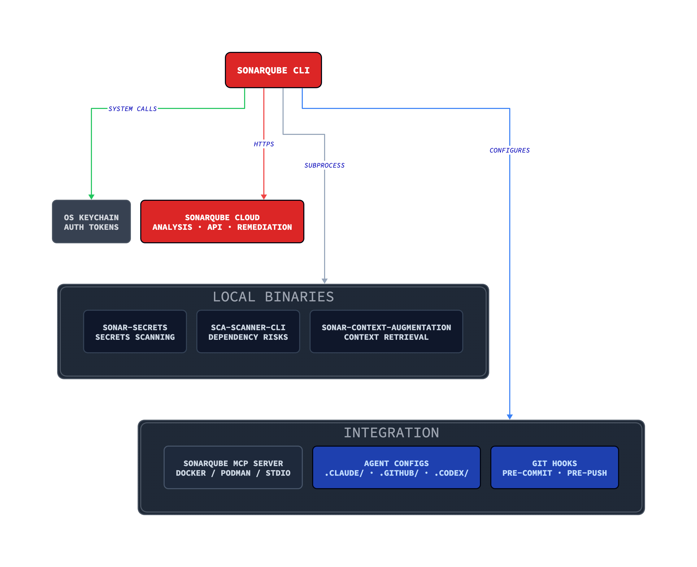
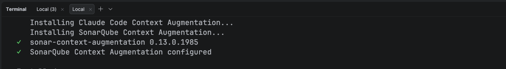
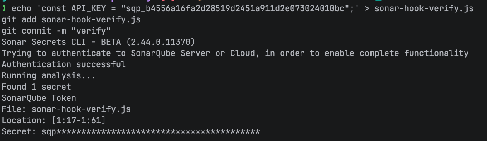

# Getting started with the SonarQube CLI

> Last updated: July 2026
> Demo commands and output reflect a June 2026 environment and may differ by release, project, organization, and entitlement. Check current product documentation before using this guide in a live environment.

## TL;DR

- The SonarQube CLI brings code analysis, secrets detection, dependency scanning, and AI agent integration into the terminal, so developers can run SonarQube workflows locally without CI pipeline configuration.
- Analysis runs against working tree changes or individual files, catching secrets, code quality issues, and dependency vulnerabilities before code reaches a pipeline.
- One integrate command configures SonarQube for Claude Code, GitHub Copilot, or Codex, installing hooks, the SonarQube MCP Server, and Context Augmentation.
- Git hooks block hardcoded secrets before they reach version control, and terminal queries provide access to project issues, quality gate status, and the SonarQube API.

## Overview

Right now, scanning a file for secrets means configuring a CI pipeline, connecting an AI coding agent to SonarQube means wiring hooks and MCP configs by hand, and checking your project's issues means opening a browser tab. The [**SonarQube CLI**](https://cli.sonarqube.com/) collapses all of that into `sonar` commands you run from the same terminal where you write code: analysis, dependency scanning, [secrets detection](https://www.sonarsource.com/solutions/secrets-detection/), [AI agent integration](https://github.com/SonarSource/sonarqube-agent-plugins), and project queries.

This blueprint walks through the full product surface: installing and authenticating the CLI, running each analysis mode, connecting it to AI coding agents ([Claude Code](https://docs.sonarsource.com/sonarqube-cli/integrations/claude-code), [GitHub Copilot](https://docs.sonarsource.com/sonarqube-cli/integrations/github-copilot), [Codex](https://docs.sonarsource.com/sonarqube-cli/integrations/codex)), adding secrets scanning to your Git workflow, querying SonarQube data, and managing the installation over time. Full project scanning (all files, all rules, quality gate evaluation) runs in CI with the SonarQube Scanner. The CLI handles change-set analysis and file-level analysis for local development workflows.

The examples use a Java/Maven project ([microsoft/gctoolkit](https://github.com/microsoft/gctoolkit)) on [SonarQube Cloud](https://www.sonarsource.com/products/sonarqube/cloud/), although most commands also work with [SonarQube Server](https://www.sonarsource.com/products/sonarqube/server/). Authentication, secrets scanning, dependency risk analysis, issue browsing, API access, and git hooks all support both platforms. [Agentic Analysis](https://www.sonarsource.com/products/sonarqube/agentic-analysis/), [Context Augmentation](https://www.sonarsource.com/products/context-augmentation/), and the [SonarQube Remediation Agent](https://www.sonarsource.com/products/sonarqube/remediation-agent/) require SonarQube Cloud.

## When to use this

You want a terminal-native interface for SonarQube that handles local analysis and AI agent setup without CI configuration. This blueprint covers the complete CLI surface. Check out the [Agent Centric Development Cycle](https://www.sonarsource.com/agent-centric-development/) for more information on how the AC/DC workflow integrates into coding sessions.

## What can you do with the SonarQube CLI?

- Secrets scanning on files, directories, and stdin from the command line
- Server-side static analysis on your working tree changes or individual files via SonarQube Agentic Analysis
- Dependency risk scanning for security vulnerabilities and license issues
- One-command AI agent integration that installs hooks, MCP server, and Sonar Context Augmentation for Claude Code, GitHub Copilot, or Codex
- Pre-commit and pre-push hooks that block commits containing hardcoded secrets
- Terminal access to your project's issues, quality gate status, and the full SonarQube API
- SonarQube Remediation Agent access for automated fix PRs on backlog issues

## Architecture



The CLI acts as a dispatcher. For analysis, it shells out to local binaries (secrets scanning, SCA) or sends file content to SonarQube Cloud (Agentic Analysis). For integration, it writes the config files that AI agents and Git read at runtime. The [SonarQube MCP Server](https://www.sonarsource.com/products/sonarqube/mcp-server/) runs in a container and provides AI agents with direct access to SonarQube tools (issue browsing, quality gates, rule lookup) outside the main analysis flow.

Dependency binaries (sonar-secrets, sca-scanner-cli) download on demand the first time you use them. The Context Augmentation binary installs during `sonar integrate`. All binaries live under `~/.sonar/sonarqube-cli/bin/` and update via `sonar self-update`.

## Prerequisites

**Required:**

- [SonarQube Cloud](https://www.sonarsource.com/products/sonarqube/cloud/) account (free tier works for most features; see conditional requirements below)
- macOS ARM64, Linux x86-64 or ARM64, or Windows x86-64 (macOS Intel is not supported)

**Conditional, depending on which capabilities you use:**

- A project imported in SonarQube Cloud with at least one CI scan completed, for Agentic Analysis (`sonar analyze agentic`) and Context Augmentation (`sonar context`). The CI scan stores project context that these features retrieve on demand.
- Docker, Podman, or Nerdctl running, for the SonarQube MCP Server (Step 3)
- [Team plan (annual billing) or Enterprise plan](https://www.sonarsource.com/plans-and-pricing/sonarcloud/) for the SonarQube Remediation Agent (`sonar remediate`)
- Context Augmentation entitlement on your organization, for `sonar context` capabilities. Organizations without it still get Agentic Analysis and secrets scanning; the Context Augmentation setup is skipped during integration.
- SonarQube Advanced Security with SCA enabled, for dependency risk scanning (`sonar analyze dependency-risks`). On SonarQube Server, requires version 2026.4 or later.

## Step 1 — Working installation and authentication

Install the CLI on Linux or macOS:

```shell
curl -o- https://raw.githubusercontent.com/SonarSource/sonarqube-cli/refs/heads/master/user-scripts/install.sh | bash
```

On Windows (PowerShell):

```powershell
irm https://raw.githubusercontent.com/SonarSource/sonarqube-cli/refs/heads/master/user-scripts/install.ps1 | iex
```

Source your shell config to pick up the new PATH entry, then verify the installation:

```shell
source ~/.zshrc  # or ~/.bashrc
sonar --version
```

```
1.0.0
```

Authenticate with SonarQube Cloud:

```shell
sonar auth login
```

The CLI opens a browser for the OAuth flow. Select your region (EU or US), enter your organization key, and complete the authorization. The token is stored in your OS keychain.

For SonarQube Server, specify the URL:

```shell
sonar auth login --server <YOUR_SERVER_URL>
```

For CI environments or automation where browser auth isn't available, set environment variables instead:

```shell
export SONARQUBE_CLI_TOKEN="<YOUR_TOKEN>"
export SONARQUBE_CLI_ORG="<YOUR_ORG>"         # SonarQube Cloud only
export SONARQUBE_CLI_SERVER="<YOUR_SERVER>"    # defaults to https://sonarcloud.io
```

Verify the connection:

```shell
sonar auth status
```

```
Verifying token......
[✓ Connected]
Server  https://sonarcloud.io
Org     <YOUR_ORG>
Source  OS Keychain
```

## Step 2 — Local analysis from the terminal

The CLI provides three analysis modes: secrets scanning, server-side static analysis (Agentic Analysis), and dependency risk scanning. Running `sonar analyze` without a subcommand executes secrets and Agentic Analysis in sequence on a single file or your working tree changes.

```shell
sonar analyze --file api/src/main/java/com/microsoft/gctoolkit/GCToolKit.java
```

```
✅ Secrets scan completed successfully

Running SonarQube Agentic Analysis...
❌ SonarQube Agentic Analysis found 13 issues:
  [1] Provide the parametrized type for this generic. (line 166)
      Rule: java:S3740
  [2] Provide the parametrized type for this generic. (line 191)
      Rule: java:S3740
  [3] Provide the parametrized type for this generic. (line 335)
      Rule: java:S3740
  [4] Reduce the total number of break and continue statements in this loop to use at most one. (line 323)
      Rule: java:S135
  ...
```

Secrets run first. If the secrets scan detects a hardcoded credential, Agentic Analysis is skipped and the CLI exits with code 51. Both analyses passing clean yields exit code 0.

### Secrets scanning

Scan individual files, directories, or standard input for hardcoded secrets. Works with both SonarQube Cloud and SonarQube Server.

```shell
sonar analyze secrets /tmp/demo-secret.py
```

```
Found 1 secret
Generic Secret
File: demo-secret.py
Location: [2:11-2:76]
Secret: sk-**************************************************************
❌ Secrets found (184ms)
  → Remove the reported secret, then rerun the scan.
```

The scanner classifies secrets by type (Generic Secret, GitHub Token, SonarQube Token) and redacts the value in output. It authenticates against SonarQube to load the complete rule set.

Pipe content from stdin to scan output from other commands or check clipboard content:

```shell
echo 'GITHUB_TOKEN=<TEST_GITHUB_TOKEN>' | sonar analyze secrets --stdin
```

```
Found 1 secret
GitHub Token
Location: [1:13-1:55]
Secret: ghp***************************************
❌ Secrets found (88ms)
  → Remove the reported secret, then rerun the scan.
```

### Agentic Analysis

Server-side static analysis against SonarQube Cloud. Requires a project with at least one CI scan completed.

Without flags, `sonar analyze agentic` analyzes your full working tree change set (staged, unstaged, and untracked files):

```shell
sonar analyze agentic
```

Target specific scopes with flags:

```shell
sonar analyze agentic --file path/to/File.java    # single file
sonar analyze agentic --staged                      # staged files only
sonar analyze agentic --base main                   # diff vs a branch
```

Output defaults to human-readable text. Use `--format json` for structured output with flow data, useful for feeding results to other tools or AI agents.

### Dependency risk scanning

Scan project dependencies for security vulnerabilities and license compliance issues. Requires SonarQube Advanced Security with SCA enabled (SonarQube Cloud, or SonarQube Server 2026.4+).  Requires a project key.

```shell
sonar analyze dependency-risks -p <PROJECT_KEY>
```

```
⚠️ 'analyze dependency-risks' is in Beta
⚠️ Dependency manifest files (e.g. package-lock.json, pom.xml) will be uploaded to SonarQube for analysis.
  → Learn more: https://docs.sonarsource.com/sonarqube-server/advanced-security/analyzing-projects-for-dependencies#supported-languages-and-package-managers
── io.vertx/vertx-core@5.0.7 (1 risk) ──────────────────────────────────────────
in: vertx/pom.xml

  LOW       OPEN     CVSS 6.9 CVE-2026-6860
  Recommended versions without known vulnerabilities: 5.0.12 (latest stable)

════════════════════════════════════════════════════════════════════════════════

Errors:
  [MISSING_LOCKFILE] pom.xml: No lockfile was found for 'pom.xml' (maven).
  [MISSING_LOCKFILE] IT/pom.xml: No lockfile was found for 'IT/pom.xml' (maven).
  [MISSING_LOCKFILE] api/pom.xml: No lockfile was found for 'api/pom.xml' (maven).
  [MISSING_LOCKFILE] gclogs/pom.xml: No lockfile was found for 'gclogs/pom.xml' (maven).
  [MISSING_LOCKFILE] parser/pom.xml: No lockfile was found for 'parser/pom.xml' (maven).
  [MISSING_LOCKFILE] sample/pom.xml: No lockfile was found for 'sample/pom.xml' (maven).
  [MISSING_LOCKFILE] vertx/pom.xml: No lockfile was found for 'vertx/pom.xml' (maven).
  [INEXACT_VERSIONS] IT/pom.xml: 'com.microsoft.gctoolkit:gctoolkit-api *' (maven) was not resolved to an exact version.
  [INEXACT_VERSIONS] IT/pom.xml: 'com.microsoft.gctoolkit:gctoolkit-parser *' (maven) was not resolved to an exact version.
  [INEXACT_VERSIONS] IT/pom.xml: 'com.microsoft.gctoolkit:gctoolkit-vertx *' (maven) was not resolved to an exact version.
  [INEXACT_VERSIONS] IT/pom.xml: 'org.junit.jupiter:junit-jupiter-api *' (maven) was not resolved to an exact version.
  [INEXACT_VERSIONS] IT/pom.xml: 'org.junit.jupiter:junit-jupiter-engine *' (maven) was not resolved to an exact version.
  [INEXACT_VERSIONS] api/pom.xml: 'org.junit.jupiter:junit-jupiter-api *' (maven) was not resolved to an exact version.
  [INEXACT_VERSIONS] api/pom.xml: 'org.junit.jupiter:junit-jupiter-engine *' (maven) was not resolved to an exact version.
  [INEXACT_VERSIONS] parser/pom.xml: 'com.microsoft.gctoolkit:gctoolkit-api *' (maven) was not resolved to an exact version.
  [INEXACT_VERSIONS] parser/pom.xml: 'org.junit.jupiter:junit-jupiter-api *' (maven) was not resolved to an exact version.
  [INEXACT_VERSIONS] parser/pom.xml: 'org.junit.jupiter:junit-jupiter-engine *' (maven) was not resolved to an exact version.
  [INEXACT_VERSIONS] sample/pom.xml: 'com.microsoft.gctoolkit:gctoolkit-api *' (maven) was not resolved to an exact version.
  [INEXACT_VERSIONS] sample/pom.xml: 'com.microsoft.gctoolkit:gctoolkit-parser *' (maven) was not resolved to an exact version.
  [INEXACT_VERSIONS] sample/pom.xml: 'com.microsoft.gctoolkit:gctoolkit-vertx *' (maven) was not resolved to an exact version.
  [INEXACT_VERSIONS] sample/pom.xml: 'org.junit.jupiter:junit-jupiter-api *' (maven) was not resolved to an exact version.
  [INEXACT_VERSIONS] sample/pom.xml: 'org.junit.jupiter:junit-jupiter-engine *' (maven) was not resolved to an exact version.
  [INEXACT_VERSIONS] vertx/pom.xml: 'com.microsoft.gctoolkit:gctoolkit-api *' (maven) was not resolved to an exact version.
  [INEXACT_VERSIONS] vertx/pom.xml: 'org.junit.jupiter:junit-jupiter-api *' (maven) was not resolved to an exact version.
  [INEXACT_VERSIONS] vertx/pom.xml: 'org.junit.jupiter:junit-jupiter-engine *' (maven) was not resolved to an exact version.

Summary: 1 dependencies checked, 1 risks found
Filtering by: new, open, confirm (discarded: accept, safe, fixed)
  MALWARE             BLOCKER ✓   0    HIGH ✓   0    MEDIUM ✓   0    LOW ✓   0    INFO ✓   0
  PROHIBITED_LICENSE  BLOCKER ✓   0    HIGH ✓   0    MEDIUM ✓   0    LOW ✓   0    INFO ✓   0
  VULNERABILITY       BLOCKER ✓   0    HIGH ✓   0    MEDIUM ✓   0    LOW ✗   1    INFO ✓   0

Recommendations:
  io.vertx/vertx-core@5.0.7 (1 risk, highest severity LOW)
    Recommended versions without known vulnerabilities: 5.0.12 (latest stable)
⚠️ Found 25 analysis errors.
❌ Found 1 unresolved dependency risk.
```

The scan found CVE-2026-6860 in vertx-core@5.0.7 with a CVSS score of 6.9 and recommended upgrading to 5.0.12. The MISSING_LOCKFILE and INEXACT_VERSIONS errors are expected for Maven projects that don't use dependency locking; they don't prevent the vulnerability scan from running.

Dependency risk scanning supports `--format json`, `--format toon`, and `--format table` output. Filter results by status with `--statuses`:

```shell
sonar analyze dependency-risks -p <PROJECT_KEY> --statuses to_fix --format json
```

The `--statuses` flag defaults to `active` (new, open, confirm) and accepts raw values (`new`, `open`, `confirm`, `accept`, `safe`, `fixed`) and presets (`active`, `to_fix`, `all`).

### Exit codes

All analysis commands use the same exit codes:

| Code | Meaning |
| :---- | :---- |
| `0` | No issues found |
| `1` | Command failure or error |
| `51` | Issues found (secrets, static analysis, or dependency risks) |

## Step 3 — AI agent integration

`sonar integrate` configures SonarQube for AI coding agents with a single command. The Claude Code integration is the most complete: it installs secrets scanning hooks, a SonarQube Agentic Analysis hook, the SonarQube MCP Server, and Context Augmentation.

```shell
sonar integrate claude -p <PROJECT_KEY>
```

The command presents four interactive prompts: secret scanning hooks, Agentic Analysis hook, MCP server, and Context Augmentation. Accept or skip based on your setup. Use `--non-interactive` to accept all defaults.

On the first run, the CLI downloads the sonar-secrets binary and sonar-context-augmentation binary, writes hook scripts and configurations, and configures the MCP server entry. After setup completes, these files exist in your project:

```
.claude/
  hooks/
    sonar-secrets/build-scripts/
      pretool-secrets.sh       # PreToolUse: scans files before Claude reads them
      prompt-secrets.sh        # UserPromptSubmit: scans prompts for secrets
    sonar-sqaa/build-scripts/
      posttool-sqaa.sh         # PostToolUse: runs Agentic Analysis after edits
  settings.json                # Hook configuration
  skills/
    sonar-context-augmentation/
      SKILL.md                 # Context Augmentation skill for Claude
.mcp.json                      # SonarQube MCP Server configuration
```



The integration also sets up `sonar context`, the CLI interface for Context Augmentation. Claude invokes this through the installed skill file to retrieve your project's architecture graph, coding standards, and guidelines before writing code. No separate configuration is needed.

For global installation (shared across all projects), use `--global`. Global installs write to `~/.claude/settings.json` and `~/.claude.json` but skip Context Augmentation and the Agentic Analysis hook, since both require a project key.

### Integration comparison

The CLI supports Claude Code, GitHub Copilot, and Codex. Each integration installs different capabilities through different mechanisms:

| Capability | Claude Code | GitHub Copilot | Codex |
| :---- | :---- | :---- | :---- |
| Secrets scanning (file reads) | Shell hook (automatic) | Shell hook (automatic) | Markdown instructions (voluntary) |
| Secrets scanning (prompts) | Shell hook (automatic) | Markdown instructions (voluntary) | Shell hook (automatic) |
| Agentic Analysis | PostToolUse shell hook (automatic) | Markdown instructions (voluntary) | PostToolUse shell hook (automatic) |
| MCP server | `.mcp.json` | `.mcp.json` or `~/.copilot/mcp-config.json` | `.codex/config.toml` |
| Context Augmentation | `.claude/skills/` | `.github/skills/` | `.agents/skills/` |

This blueprint demoed `sonar integrate claude`.

Claude Code and Codex use shell hooks that fire automatically on file edits and prompt submissions. The agent cannot skip them. Copilot uses shell hooks for file-read secrets scanning, but relies on markdown instructions for prompt-level secrets scanning and Agentic Analysis, because Copilot does not surface hook output back to the agent in-band.

```shell
sonar integrate copilot -p <PROJECT_KEY>
sonar integrate codex -p <PROJECT_KEY>
```

### The Agent Centric Development Cycle

With the integration in place, the full Agent Centric Development Cycle runs through three stages. Claude receives coding guidelines and architecture context before it writes code (Guide, via Context Augmentation). When it edits a file, the PostToolUse hook runs Agentic Analysis and feeds any findings back into Claude's context, where the agent self-corrects (Verify). For backlog issues that need fix PRs, `sonar remediate` submits them to the SonarQube Remediation Agent (Solve).

### Triggering the Remediation Agent

`sonar remediate` submits backlog issues to the **SonarQube Remediation Agent**, which generates fix PRs. In interactive mode, the CLI fetches eligible issues and presents a multi-select prompt:

```shell
sonar remediate -p <PROJECT_KEY>
```

```
  ✓  Fetching eligible issues for <PROJECT_KEY>
  500 eligible issues found

  ?  Which issues should the agent fix?  (Space to toggle, Enter to confirm, q to quit)
    ❯ ◯  BLOCKER   java:S1845  api/.../ZGCCollection.java
         Rename method "getMmu" to prevent any misunderstanding/clash with method "getMMU".
      ◯  BLOCKER   java:S1845  api/.../DateTimeStamp.java
         Rename field "TIMESTAMP" to prevent any misunderstanding/clash with field "timeStamp".
      ◯  BLOCKER   java:S2178  api/.../Diary.java
         Correct this "&" to "&&" and extract the right operand to a variable...
      ↓ 497 more
```

The Remediation Agent requires a [Team plan (annual billing) or Enterprise plan](https://www.sonarsource.com/plans-and-pricing/sonarcloud/). The CLI checks your entitlement before submitting.

## Step 4 — Secrets scanning in Git hooks

The CLI installs Git hooks that scan for secrets independently of any AI agent. Use pre-commit to catch secrets before they enter your local history, or pre-push to catch them before they reach the remote.

```shell
sonar integrate git --hook pre-commit
```

```
  ━━━━━━━━━━━━━━━━━━━━━━━━━━━━━━━━━━━━━━━━━━
  SonarQube Git Integration (secrets scanning)
  ━━━━━━━━━━━━━━━━━━━━━━━━━━━━━━━━━━━━━━━━━━

  Repository
    ✓  Root: ~/path/to/<PROJECT_DIRECTORY>
    ✓  Git repository: detected
    ✓  Hooks directory: ~/path/to/<PROJECT_DIRECTORY>/.git/hooks
    ℹ  Framework: native git hooks

  ✓  Where should SonarQube be integrated? This project

     Installing pre-commit hook...

  Installed
    ✓  pre-commit hook
       ~/path/to/<PROJECT_DIRECTORY>/.git/hooks/pre-commit

  ━━━━━━━━━━━━━━━━━━━━━━━━━━━━━━━━━━━━━━━━━━
  ✅  Setup complete!
  ━━━━━━━━━━━━━━━━━━━━━━━━━━━━━━━━━━━━━━━━━━
```

Your hooks framework (native git hooks, Husky, or pre-commit framework) is auto-detected, and the hook is installed accordingly.

Verify by staging a file with a known secret:

```shell
echo 'const API_KEY = "<TEST_SONARQUBE_TOKEN>";' > sonar-hook-verify.js
git add sonar-hook-verify.js
git commit -m "verify"
```

```
Found 1 secret
SonarQube Token
File: sonar-hook-verify.js
Location: [1:17-1:61]
Secret: sqp*****************************************

❌ Secrets detected in staged files.
  → Remove the reported secret, then retry the commit.
```



The commit is blocked. Clean up the test file:

```shell
git reset HEAD sonar-hook-verify.js
rm sonar-hook-verify.js
```

For pre-push hooks:

```shell
sonar integrate git --hook pre-push
```

The pre-push hook scans files in unpushed commits. It can also be configured to scan dependency manifests for risks when you provide a project key.

For org-wide enforcement, use `--global` to set `git config --global core.hooksPath` to a managed hooks directory. Use `--force` to overwrite an existing hook that wasn't installed by the CLI.

## Step 5 — Terminal access to SonarQube data

`sonar list` queries your SonarQube projects and issues without leaving the terminal.

```shell
sonar list issues -p <PROJECT_KEY> --format table --page-size 10
```

```
SEVERITY | RULE            | MESSAGE                                                          | FILE
------------------------------------------------------------------------------------------------------------------------------
CRITICAL | java:S115       | Rename this constant name to match the regular expression...     | api/.../GarbageCollectionTypes.java:13
CRITICAL | java:S115       | Rename this constant name to match the regular expression...     | api/.../GarbageCollectionTypes.java:58
INFO     | java:S5786      | Remove this 'public' modifier.                                   | parser/.../UnifiedGenerationalEventsTest.java:88
MAJOR    | java:S1066      | Merge this if statement with the enclosing one.                  | parser/.../Decorators.java:138
MAJOR    | java:S5961      | Refactor this method to reduce the number of assertions from...  | parser/.../GenerationalZGCParserTest.java:33
...
```

The same query in toon format, a YAML-like encoding optimized for LLM token consumption:

```shell
sonar list issues -p <PROJECT_KEY> --format toon --page-size 3
```

```
total: 1246
p: 1
ps: 3
issues[3]:
  - key: AZ5rbJ6BeB431-anI7s1
    rule: "java:S115"
    severity: CRITICAL
    component: "...GarbageCollectionTypes.java"
    line: 13
    status: OPEN
    message: "Rename this constant name to match the regular expression..."
    cleanCodeAttribute: IDENTIFIABLE
    impacts[1]{softwareQuality,severity}:
      MAINTAINABILITY,HIGH
    ...
```

Four output formats serve different consumers: `table` for terminal reading, `toon` for AI agents (fewer tokens, same information), `json` for programmatic access, and `csv` for spreadsheet import.

Filter by status and severity:

```shell
sonar list issues -p <PROJECT_KEY> --statuses OPEN --severities CRITICAL --format table
```

Search for projects by name (output is JSON by default):

```shell
sonar list projects -q gctoolkit
```

For anything `sonar list` doesn't cover, `sonar api` is an authenticated HTTP client for any SonarQube endpoint. Query quality gate status:

```shell
sonar api get "/api/qualitygates/project_status?projectKey=<PROJECT_KEY>"
```

The command returns raw JSON on a single line. Pipe through `jq` to format it (output abbreviated for readability):

```shell
sonar api get "/api/qualitygates/project_status?projectKey=<PROJECT_KEY>" | jq .
```

```json
{
  "projectStatus": {
    "status": "OK",
    "conditions": [
      {"status": "OK", "metricKey": "new_reliability_rating", "comparator": "GT", "errorThreshold": "1", "actualValue": "1"},
      {"status": "OK", "metricKey": "new_security_rating", "comparator": "GT", "errorThreshold": "1", "actualValue": "1"},
      {"status": "OK", "metricKey": "new_maintainability_rating", "comparator": "GT", "errorThreshold": "1", "actualValue": "1"},
      {"status": "OK", "metricKey": "new_coverage", "comparator": "LT", "errorThreshold": "80"},
      {"status": "OK", "metricKey": "new_duplicated_lines_density", "comparator": "GT", "errorThreshold": "3"},
      {"status": "OK", "metricKey": "new_security_hotspots_reviewed", "comparator": "LT", "errorThreshold": "100", "actualValue": "100.0"}
    ]
  }
}
```

Add `--verbose` for request/response debugging. The CLI redacts your auth token in verbose output:

```shell
sonar api get "/api/system/status" --verbose
```

```
request method: GET
request url: https://sonarcloud.io/api/system/status
request headers: {"Authorization":"REDACTED",...}
response status: 200
```

`sonar api` takes any HTTP method as its first argument. Pass a JSON body with `--data`:

```shell
sonar api post "/api/issues/do_transition" --data '{"issue":"<ISSUE_KEY>","transition":"accept"}'
```

## Step 6 — CLI health and updates

`sonar system status` provides a full diagnostic view of your installation: authentication state, installed binaries with versions, cache locations, and configured integrations.

Before any integrations are configured:

```shell
sonar system status
```

```
✅ SYSTEM CHECK: Healthy
AUTHENTICATION
  • Server:  https://sonarcloud.io
  • Org:     <YOUR_ORG>
  • Token:   Active
BINARIES
  • Secrets Detection: Installed (~/.sonar/sonarqube-cli/bin/sonar-secrets-2.44.0.11370-macos-arm64)
      Version:  v2.44.0.11370
  • Dependency Risks Scanner: Installed (~/.sonar/sonarqube-cli/bin/sca-scanner-cli-2025.6.0.14965-macos-arm64)
      Version:  v2025.6.0.14965
CACHE
  • Logs: ~/.sonar/sonarqube-cli/logs
  • Dependency Risks Scanner Cache: ~/.sonar/sonarqube-cli/sca-scanner-cache
  • Global Git Hooks: empty
```

After running `sonar integrate claude` and `sonar integrate git`, the output expands to show the additional components:

```
✅ SYSTEM CHECK: Healthy
AUTHENTICATION
  • Server:  https://sonarcloud.io
  • Org:     <YOUR_ORG>
  • Token:   Active
BINARIES
  • Secrets Detection: Installed (~/.sonar/sonarqube-cli/bin/sonar-secrets-2.44.0.11370-macos-arm64)
      Version:  v2.44.0.11370
  • Dependency Risks Scanner: Installed (~/.sonar/sonarqube-cli/bin/sca-scanner-cli-2025.6.0.14965-macos-arm64)
      Version:  v2025.6.0.14965
  • Sonar Context Augmentation: Installed (~/.sonar/sonarqube-cli/bin/sonar-context-augmentation-0.13.0.1985-macos-arm64)
      Version:  v0.13.0
INTEGRATIONS
  • Claude Code: CONFIGURED (~/path/to/<PROJECT_DIRECTORY>/.claude/settings.json)
    • MCP Server: CONFIGURED
  • Native Git integration: CONFIGURED (~/path/to/<PROJECT_DIRECTORY>/.git/hooks/pre-commit)
```

Update the CLI, all dependency binaries, and integration configs:

```shell
sonar self-update
```

Check for updates without installing:

```shell
sonar self-update --status
```

```
  ℹ  Checking for updates...
Current version: v1.0.0
Latest version:  v1.0.0
✅ Already up to date
```

Reset to factory defaults (removes tokens, binaries, integrations, and cached files; preserves telemetry settings):

```shell
sonar system reset
```

Opt out of telemetry:

```shell
sonar config telemetry --disabled
```

## Configuration reference

### Environment variables

| Variable | Purpose |
| :---- | :---- |
| `SONARQUBE_CLI_TOKEN` | Authentication token (overrides keychain) |
| `SONARQUBE_CLI_SERVER` | Server URL (defaults to `https://sonarcloud.io`) |
| `SONARQUBE_CLI_ORG` | Organization key (SonarQube Cloud only) |
| `NODE_EXTRA_CA_CERTS` | Path to PEM file for self-signed certificates |
| `DO_NOT_TRACK=1` | Disable telemetry for the session |

### Project key resolution

Project keys resolve in this order:

1. `--project` flag on the command
2. `.sonarlint/connectedMode.json` in the workspace root
3. `sonar.projectKey` in `sonar-project.properties` at the repo root
4. Git remote URL matching against SonarQube Cloud projects (Agentic Analysis only)

If none of these resolve, the CLI prompts for a project key or returns an error.

### Global vs. project scope

Most `sonar integrate` commands accept a `--global` flag. Project-scope installs (the default) write config files into the repo directory, so they're version-controlled and visible to the team. Global installs write to your home directory (`~/.claude/settings.json`, `~/.claude.json`, etc.) and apply to every repo on the machine, but skip Context Augmentation and the Agentic Analysis hook since both require a project key.

Use project scope when you want the team to inherit the integration by pulling the repo. Use global scope for personal defaults (secrets scanning hooks, MCP server) that you want everywhere without per-repo setup.

### Self-signed certificates

The CLI runs on the Bun runtime, which does not read the OS certificate store by default. For SonarQube Server behind a self-signed certificate, set the `NODE_EXTRA_CA_CERTS` environment variable to the path of your CA bundle:

```shell
export NODE_EXTRA_CA_CERTS=/path/to/your/ca-bundle.pem
```

### Uninstall

Linux/macOS:

```shell
rm -rf ~/.local/share/sonarqube-cli
rm -rf ~/.sonar/sonarqube-cli
```

Remove the PATH entry from your shell profile (`~/.zshrc`, `~/.bashrc`, or `~/.config/fish/config.fish`).

Windows (PowerShell):

```
Remove-Item -Recurse -Force "$env:LOCALAPPDATA\sonarqube-cli"
Remove-Item -Recurse -Force "$HOME\.sonar\sonarqube-cli"
```

## What to know

**Agentic Analysis, Context Augmentation, and the Remediation Agent require SonarQube Cloud.** Secrets scanning, dependency risk analysis, issue browsing, API access, and git hooks work with both SonarQube Cloud and SonarQube Server. Dependency risk scanning requires SonarQube Advanced Security with SCA enabled. The Remediation Agent further requires a [Team plan (annual billing) or Enterprise plan](https://www.sonarsource.com/plans-and-pricing/sonarcloud/), and Context Augmentation requires an org-level entitlement.

The MCP server requires a container runtime (Docker, Podman, or Nerdctl). If you don't have one, `sonar integrate` skips MCP setup and the rest of the integration proceeds normally.

`sonar verify` is deprecated and hidden from the help output. Use `sonar analyze agentic` instead. Running `sonar verify` still works but prints a deprecation warning, and it will be removed in a future major version.

macOS Intel (x86-64) is not supported; the CLI ships binaries for macOS ARM64, Linux x86-64 and ARM64, and Windows x86-64.

## Next steps

- [SonarQube CLI documentation](https://cli.sonarqube.com) has the complete command reference and configuration details
- [SonarQube Cloud documentation](https://docs.sonarsource.com/sonarqube-cloud/) covers CI scanner setup, quality gate configuration, and project administration
- [Share feedback on the CLI](https://forms.gle/xE61HS2E5NzxFCSR9) to report issues or request features
